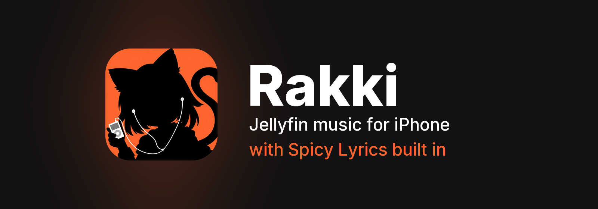
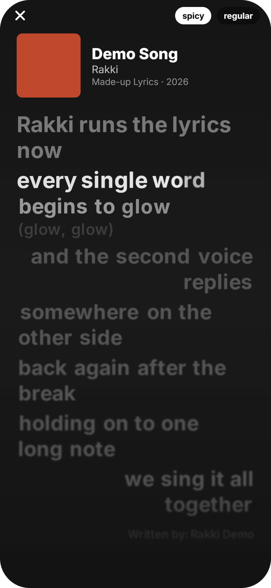
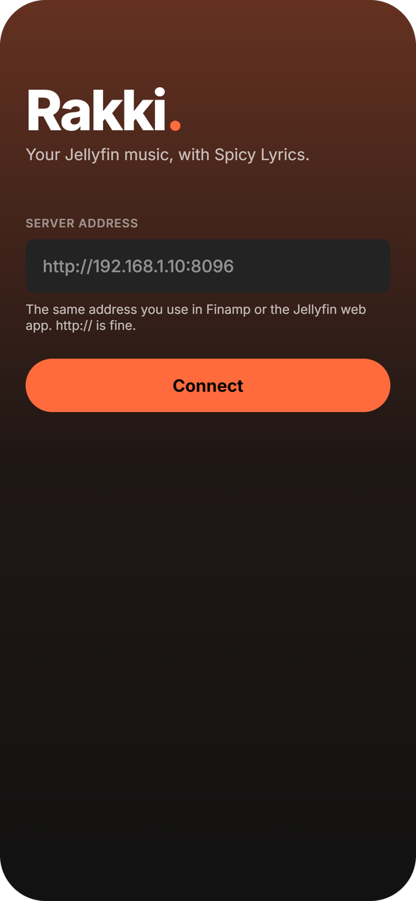
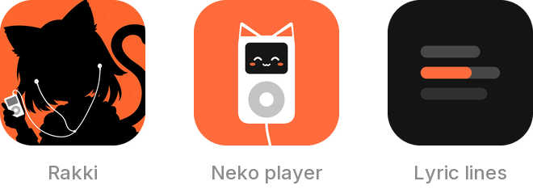

<p align="center">
  
</p>

<p align="center">
  <a href="https://github.com/LuckiRakki/rakki/releases/tag/ios-latest"></a>
  
  
  
  <a href="LICENSE"></a>
</p>

<p align="center">
  <a href="https://github.com/LuckiRakki/rakki/actions/workflows/check.yml"></a>
  <a href="https://github.com/LuckiRakki/rakki/actions/workflows/update.yml"></a>
</p>

<p align="center">
  <b><a href="#install">Install</a></b> ·
  <b><a href="#features">Features</a></b> ·
  <b><a href="#screenshots">Screenshots</a></b> ·
  <b><a href="#build-it-yourself">Build it yourself</a></b> ·
  <b><a href="docs/CHANGELOG.md">Changelog</a></b>
</p>

---

**Rakki** is a music app for your own [Jellyfin](https://jellyfin.org) server, made for the
iPhone. It looks and feels like Spotify, does what Finamp and Feishin do, and has
**[Spicy Lyrics](https://github.com/Spikerko/spicy-lyrics)** at its heart: word-by-word
karaoke lyrics that glow, lift and pop as they're sung.

It's built with React Native and Expo, plays through its own gapless audio engine written in
Swift, and updates itself over the air. Building and running it needs no Mac and no paid
Apple account.

## Screenshots

<p align="center">
  
  &nbsp;&nbsp;
  
  &nbsp;&nbsp;
  
</p>
<p align="center"><sub>Spicy lyrics · Regular lyrics · Sign in (lyrics shown with the built-in demo song)</sub></p>

## Features

### Lyrics, two ways
- **Spicy mode** (the default): the Spicy Lyrics engine on a GPU canvas. Every word has its
  own springs for size, lift and glow; long notes are spelled out letter by letter; duets sit
  left and right; background vocals, instrumental dots, and depth blur on the lines around
  the one being sung. Tap a line to jump to it.
- **Regular mode**: clean line-by-line lyrics on the album's colour, for when you just want to
  read along. One tap switches between the two.
- Japanese, Chinese, Korean and other scripts fall back to iOS's own fonts.
- A lyrics style editor (size, font, colour, motion, backdrop) with a live preview.

### Player
- Its own **gapless** engine (an AVQueuePlayer that always has the next song ready), with the
  lock screen, Control Center, AirPlay and headphone controls.
- A queue with drag to reorder, Next in queue, shuffle and repeat, restored on launch.
- A **smart queue** for autoplay and song/artist radio: songs like the ones playing, from what
  Last.fm listeners play alongside them, the artists they like next, your own likes and most
  played, and Jellyfin's instant mix, mixing songs you know with new ones. The first song
  starts at once; the rest fills in behind it within seconds.
- A sleep timer, volume normalization and song credits.
- A **performance log** (Settings): what the app does to the phone (CPU, memory, heat,
  battery), sent to your Jellyfin server to look into battery drain.
- A **visualizer** that follows the actual sound, in the mini-player and the lyrics screen.
- **Music videos** from your Jellyfin library, matched to your songs and played in the app
  (picture in picture, AirPlay).

### Your library
- **Home** with Jump back in, Recently added, Most played, Rediscover and more (reorder or
  hide any of them). **Search** that forgives typos. A **Library** with Playlists, Albums,
  Songs, Artists, Genres, Radio and Downloads (hold a tab to reorder them).
- Album, artist, playlist and genre pages, a Spotify-style **Add to playlist** that shows
  where a song already is, and playlist editing.
- **Popular worldwide**: artists' top songs and album play counts from Last.fm (with your own
  free API key), or sorted by your own plays.

### Offline
- Download albums, playlists and Liked Songs, with their lyrics and covers. They're real
  files you can see in the Files app.
- Offline mode plays what's on the phone, and plays made offline still count once you're back.

### Radio
- Any internet radio by its address, plus **SUB/WAVE** stations built in: what's on air, the
  show and DJ, song requests, recently played, and lyrics that follow the live stream.
- A proper live lock screen: LIVE, stop, no skipping.

### Make it yours
- An accent colour of your choice, or **Lucid**: the colour of the album that's playing.
- Fonts, text size, roundness, density, grid columns, mini-player style and more, with
  presets and a live preview.
- Three app icons, Home Screen and Lock Screen **widgets**, and multiple Jellyfin accounts.

<p align="center">
  
</p>

## Install

Rakki is sideloaded with **[SideStore](https://sidestore.io)** and a free Apple ID.

1. Set up SideStore on your iPhone (its site walks you through it).
2. On the iPhone, download **[Rakki.ipa](https://github.com/LuckiRakki/rakki/releases/download/ios-latest/Rakki.ipa)**
   from the [latest release](https://github.com/LuckiRakki/rakki/releases/tag/ios-latest).
3. In SideStore, go to **My Apps → +** and pick the file.
4. Open Rakki and enter your Jellyfin server's address (`http://` works too), then sign in with
   your password or Quick Connect.

**Updates arrive on their own.** New versions are published over the air and download the
next time you open Rakki (or right away from **Settings → About → Check for updates**). You
only need a new `.ipa` when the native side changes; the changelog says when.

**For word-by-word lyrics**, the server needs the Spicy Lyrics plugin for Jellyfin. Without
it, Rakki uses Jellyfin's own lyrics (LRC or plain text).

## Build it yourself

Everything runs on Windows, macOS or Linux; iOS builds happen on GitHub's Macs.

```bash
npm install
npm run web:setup              # once: the canvas library for Spicy lyrics in the browser
npm run web                    # the web preview (most screens)
npm run phone -- --dev-client  # dev server on this PC's Tailscale address, for Rakki Dev
npm run typecheck
npm run lint
```

| Workflow | When | What it does |
|---|---|---|
| [`check.yml`](.github/workflows/check.yml) | every push | typecheck and lint |
| [`update.yml`](.github/workflows/update.yml) | every push to `main` | publishes an over-the-air update (EAS Update) |
| [`ios.yml`](.github/workflows/ios.yml) | by hand | builds an unsigned `.ipa`: `release` (published as `ios-latest`), `dev` (Rakki Dev, which loads code from your PC) or `check` (build only) |

The plan, architecture and decisions are in **[docs/FRAMEWORK.md](docs/FRAMEWORK.md)**; what
changed in each version is in **[docs/CHANGELOG.md](docs/CHANGELOG.md)**.

```
src/app/               screens (Expo Router)
src/player/            queue, playback reporting, sleep timer, offline listens
src/spicy/             the Spicy Lyrics renderer (Skia)
src/lyrics/            lyrics loading and Regular mode
src/radio/             internet radio and SUB/WAVE
src/widgets/           Home Screen and Lock Screen widgets
modules/rakki-audio/   the native audio engine (Swift)
```

## Thanks

Rakki stands on other people's work: [Spicy Lyrics](https://github.com/Spikerko/spicy-lyrics)
(the lyrics engine), [Finamp](https://github.com/jmshrv/finamp) and `just_audio` (how a
gapless iOS player is built), [Feishin](https://github.com/jeffvli/feishin) (the look and the
feature set), [Jellyfin](https://jellyfin.org) and [Expo](https://expo.dev). Details are in
[NOTICE.md](NOTICE.md).

## Licence

[AGPL-3.0](LICENSE). Rakki isn't affiliated with Jellyfin, Spotify or Spicy Lyrics.
